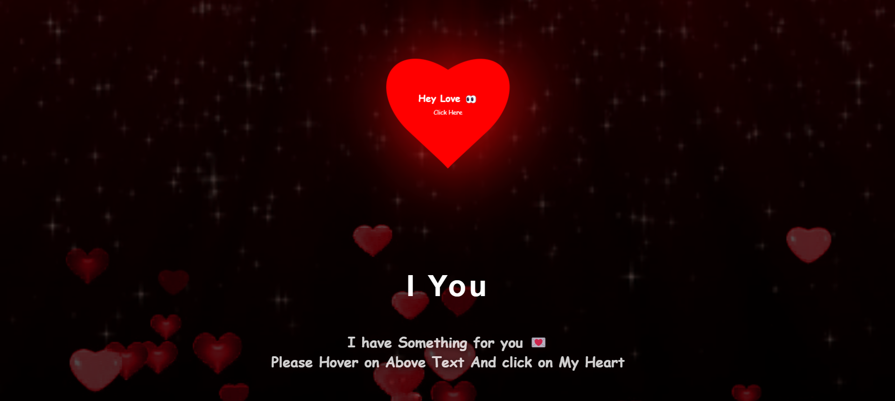

# Hidden Secrets

## Purpose
Have you ever found it difficult to reveal a secret to someone? **Hidden Secrets** is an interactive web project designed to mirror that very feeling of hesitation and intrigue. Just like hiding a secret, the project lets you uncover something hidden only when you engage with it—by hovering over the page. The background changes, and a secret message appears, providing an immersive experience that draws users into the world of mystery. 

## Features
- **Full-screen canvas background** with dynamic animations that evolve as users interact with the page.
- **Hover effect** that reveals a hidden secret message when users hover over the page.
- **Responsive design** that ensures a smooth user experience across various screen sizes.
- **Smooth transitions** that make the uncovering of the secret message feel seamless and engaging.
- **Customizable styles** that make it easy to modify text, fonts, background colors, and animations.

## Preview
Here’s a preview of how the project looks:

 

## How It Works
The project leverages a combination of HTML, CSS, and JavaScript to deliver the following features:

- **HTML Canvas**: The background is a dynamic canvas that responds to user interaction and provides a visually rich experience.
- **CSS**: It handles the hover effect, text centering, and overall styling to ensure the secret remains hidden until revealed by user action.
- **JavaScript**: The script controls the hover functionality, revealing the hidden secret when triggered by the user’s interaction.

### Hover to Reveal the Secret Message
The secret message stays hidden until the user hovers over the page. This effect is implemented using the `:hover` pseudo-class in CSS and a hidden `
` element that appears when triggered, adding a layer of excitement as the secret is unveiled.

## Installation

1. **Clone the repository** or download the ZIP file.

2. **Open the project folder** in your code editor.

3. **Open the `home.html` file** in your browser to view the project.

## Customization
Easily modify these elements in the project to personalize the experience:

- **Text**: Change the content inside the `
` tag in `home.html`.
- **Font**: Alter the `font-family` property in the `.overlay` class within `home.css`.
- **Background color**: Modify the `background-color` property in the `body` or `.overlay` in `style.css`.
- **Hover Message**: Edit the hidden message inside the `.secret-message` div in `message.html`.

## Technology Stack
- **HTML5**: For structure and layout of the page.
- **CSS3**: For styling, animations, and responsiveness.
- **JavaScript**: For dynamic adjustments and user interaction, including the hover effect.

## Contributing
Feel free to fork this repository, submit pull requests, or open issues for improvements or bug fixes. Please ensure to follow best practices and maintain the project structure.

Thanks for exploring the **Hidden Secrets** project! If you found it useful or have suggestions for improvement, feel free to open an issue or submit a pull request.

---

## **Secret Message**:
Shh... Here's a secret just for you 💌... I love you soooo much, but let's keep it between us 💞!

